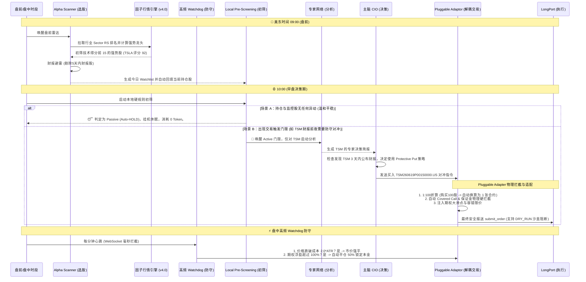

# LP-Agent v4.0: 证券交易自主智能体 (Multi-Broker Decoupled Core)

[](LICENSE)
[](https://www.python.org/downloads/)
[](#)

LP-Agent v4.0 是一款基于 **Strategic Multi-Agent (SMA)** 架构、全面重构为**“行情-交易物理解耦分离”**的高鲁棒性美股量化交易智能体。系统模拟专业对冲基金运行模式，由 **CIO (首席投资官)** 统筹五大专家矩阵，并结合 **Watchdog (毫秒级高频监控)** 与 **Long-term Memory (长效教训记忆)**。

在 V4.0 架构中，长桥（LongPort）被定义为高阶数据行情引擎，而交易执行层通过 `BaseTradingEngine` 彻底重构为**“可拔插券商适配器 (Pluggable Broker Adaptor)”**，完美兼容三大立体期权武器、四大物理防御网以及零资金 DRY_RUN 沙盒系统。

---

## 🏛️ 系统立体分层逻辑架构 (System Full-Stack Architecture)

为了实现系统各层级职责的极致内聚与高解耦，并提供令投资人折服、工业级稳固的系统透视。LP-Agent v4.0 将整个系统的运行机制模块化地划分为以下 **5大标准逻辑层级**。

我们专门设计了下方这套**科技感十足、完美适配浅色与深色模式的像素级 3D 浮雕式分层逻辑架构图**，它精确展现了从毫秒级行情捕获、CIO 主脑推理决策，到物理级 PRR 利润自愈锁和多态飞书监控的完整全景。

<div align="center">
  <svg width="100%" height="100%" viewBox="0 0 960 740" style="background:#0B1329; border-radius:12px; box-shadow:0 20px 40px rgba(0,0,0,0.5); font-family:'Inter', system-ui, sans-serif;">
    <defs>
      <!-- Gradients for standard card backgrounds -->
      <linearGradient id="layer-grad" x1="0%" y1="0%" x2="100%" y2="100%">
        <stop offset="0%" stop-color="#1E293B" />
        <stop offset="100%" stop-color="#0F172A" />
      </linearGradient>
      <linearGradient id="header-grad" x1="0%" y1="0%" x2="100%" y2="0%">
        <stop offset="0%" stop-color="#1E40AF" />
        <stop offset="50%" stop-color="#3B82F6" />
        <stop offset="100%" stop-color="#1D4ED8" />
      </linearGradient>
      <!-- Neon glows for layer borders -->
      <linearGradient id="border-cyan" x1="0%" y1="0%" x2="100%" y2="0%">
        <stop offset="0%" stop-color="#06B6D4" />
        <stop offset="100%" stop-color="#3B82F6" />
      </linearGradient>
      <linearGradient id="border-gold" x1="0%" y1="0%" x2="100%" y2="0%">
        <stop offset="0%" stop-color="#F59E0B" />
        <stop offset="100%" stop-color="#EF4444" />
      </linearGradient>
      <linearGradient id="border-purple" x1="0%" y1="0%" x2="100%" y2="0%">
        <stop offset="0%" stop-color="#8B5CF6" />
        <stop offset="100%" stop-color="#EC4899" />
      </linearGradient>
      <linearGradient id="border-emerald" x1="0%" y1="0%" x2="100%" y2="0%">
        <stop offset="0%" stop-color="#10B981" />
        <stop offset="100%" stop-color="#059669" />
      </linearGradient>
      <linearGradient id="border-violet" x1="0%" y1="0%" x2="100%" y2="0%">
        <stop offset="0%" stop-color="#6366F1" />
        <stop offset="100%" stop-color="#4F46E5" />
      </linearGradient>
      
      <!-- Drop shadow filters -->
      <filter id="card-shadow" x="-10%" y="-10%" width="120%" height="120%">
        <feDropShadow dx="0" dy="8" stdDeviation="6" flood-color="#000000" flood-opacity="0.6"/>
      </filter>
    </defs>

    <!-- Background Decoration Grid -->
    <g stroke="#ffffff" stroke-opacity="0.03" stroke-width="1">
      <path d="M 0,50 L 960,50 M 0,100 L 960,100 M 0,150 L 960,150 M 0,200 L 960,200 M 0,250 L 960,250 M 0,300 L 960,300 M 0,350 L 960,350 M 0,400 L 960,400 M 0,450 L 960,450 M 0,500 L 960,500 M 0,550 L 960,550 M 0,600 L 960,600 M 0,650 L 960,650 M 0,700 L 960,700" />
      <path d="M 100,0 L 100,740 M 200,0 L 200,740 M 300,0 L 300,740 M 400,0 L 400,740 M 500,0 L 500,740 M 600,0 L 600,740 M 700,0 L 700,740 M 800,0 L 800,740 M 900,0 L 900,740" />
    </g>

    <!-- Top Banner Title -->
    <rect x="0" y="0" width="960" height="60" fill="url(#header-grad)" />
    <text x="30" y="38" fill="#FFFFFF" font-size="20" font-weight="800" letter-spacing="1">LP-AGENT v4.0 FULL-STACK ARCHITECTURE</text>
    <rect x="740" y="16" width="190" height="28" rx="14" fill="#000000" fill-opacity="0.4" />
    <circle cx="756" cy="30" r="5" fill="#34D399" />
    <text x="768" y="34" fill="#E2E8F0" font-size="11" font-weight="700">Broker-Decoupled Live</text>

    <!-- ================= LAYER 1: PERCEPTION ================= -->
    <g filter="url(#card-shadow)">
      <!-- Outer glowing border -->
      <rect x="30" y="85" width="900" height="100" rx="8" fill="url(#layer-grad)" stroke="url(#border-cyan)" stroke-width="1.5" />
      <!-- Left indicator badge -->
      <rect x="42" y="97" width="160" height="24" rx="4" fill="#06B6D4" fill-opacity="0.15" />
      <text x="50" y="113" fill="#22D3EE" font-size="11" font-weight="800" letter-spacing="0.5">1. PERCEPTION LAYER</text>
      <text x="42" y="156" fill="#94A3B8" font-size="11" font-weight="500">Real-time market sensing & ingestion</text>
      
      <!-- Sub-Component Cards -->
      <!-- WS Watchdog -->
      <rect x="220" y="97" width="220" height="76" rx="6" fill="#0F172A" stroke="#1E293B" stroke-width="1" />
      <text x="232" y="120" fill="#38BDF8" font-size="12" font-weight="700">WebSocket Watchdog</text>
      <text x="232" y="138" fill="#64748B" font-size="10">Millisecond push-driven triggers</text>
      <text x="232" y="154" fill="#38BDF8" font-size="10" font-weight="600">8% Stop & High-Breakout Capture</text>

      <!-- 1-Min Watchdog -->
      <rect x="455" y="97" width="220" height="76" rx="6" fill="#0F172A" stroke="#1E293B" stroke-width="1" />
      <text x="467" y="120" fill="#38BDF8" font-size="12" font-weight="700">1-Min Cron Watchdog</text>
      <text x="467" y="138" fill="#64748B" font-size="10">High-frequency local polling radar</text>
      <text x="467" y="154" fill="#38BDF8" font-size="10" font-weight="600">ATR-based Dynamic Stop-losses</text>

      <!-- Qlib Quant Engine -->
      <rect x="690" y="97" width="220" height="76" rx="6" fill="#0F172A" stroke="#1E293B" stroke-width="1" />
      <text x="702" y="120" fill="#38BDF8" font-size="12" font-weight="700">Qlib Quant Engine</text>
      <text x="702" y="138" fill="#64748B" font-size="10">Microsoft Open-source Multi-Factor</text>
      <text x="702" y="154" fill="#38BDF8" font-size="10" font-weight="600">GRU/LightGBM Alpha158 Sorting</text>
    </g>

    <!-- Connecting Arrow Layer 1 -> Layer 2 -->
    <path d="M 480,185 L 480,205" fill="none" stroke="#38BDF8" stroke-width="2" marker-end="url(#arrow)" stroke-dasharray="4 4" />

    <!-- ================= LAYER 2: DECISION ================= -->
    <g filter="url(#card-shadow)">
      <rect x="30" y="210" width="900" height="110" rx="8" fill="url(#layer-grad)" stroke="url(#border-gold)" stroke-width="1.5" />
      <rect x="42" y="222" width="160" height="24" rx="4" fill="#F59E0B" fill-opacity="0.15" />
      <text x="50" y="238" fill="#FBBF24" font-size="11" font-weight="800" letter-spacing="0.5">2. DECISION LAYER</text>
      <text x="42" y="285" fill="#94A3B8" font-size="11" font-weight="500">Expert analysis & cognitive reasoning</text>

      <!-- Portfolio / Risk Manager -->
      <rect x="220" y="222" width="180" height="86" rx="6" fill="#0F172A" stroke="#1E293B" stroke-width="1" />
      <text x="232" y="244" fill="#FBBF24" font-size="12" font-weight="700">Risk & Port Manager</text>
      <text x="232" y="264" fill="#64748B" font-size="10">Linear Risk Scoring</text>
      <text x="232" y="280" fill="#FBBF24" font-size="10" font-weight="600">Dynamic Sector Limits</text>

      <!-- Parallel Expert Matrix -->
      <rect x="415" y="222" width="240" height="86" rx="6" fill="#0F172A" stroke="#1E293B" stroke-width="1" />
      <text x="427" y="244" fill="#FBBF24" font-size="12" font-weight="700">Expert Matrix (Sem=2)</text>
      <text x="427" y="264" fill="#64748B" font-size="10">Multi-threaded parallel research briefings</text>
      <text x="427" y="280" fill="#FBBF24" font-size="10" font-weight="600">Tech / Fund / Sentiment / Quant</text>

      <!-- CIO ReAct Brain -->
      <rect x="670" y="222" width="240" height="86" rx="6" fill="#0F172A" stroke="#1E293B" stroke-width="1" />
      <text x="682" y="244" fill="#EF4444" font-size="12" font-weight="700">CIO ReAct Brain</text>
      <text x="682" y="264" fill="#64748B" font-size="10">Thought-Action-Observation loop</text>
      <text x="682" y="280" fill="#EF4444" font-size="10" font-weight="600">Advanced Option / Sizing Strategy</text>
    </g>

    <!-- Connecting Arrow Layer 2 -> Layer 3 -->
    <path d="M 480,320 L 480,340" fill="none" stroke="#F59E0B" stroke-width="2" marker-end="url(#arrow)" stroke-dasharray="4 4" />

    <!-- ================= LAYER 3: ADAPTER ================= -->
    <g filter="url(#card-shadow)">
      <rect x="30" y="345" width="900" height="100" rx="8" fill="url(#layer-grad)" stroke="url(#border-purple)" stroke-width="1.5" />
      <rect x="42" y="357" width="160" height="24" rx="4" fill="#8B5CF6" fill-opacity="0.15" />
      <text x="50" y="373" fill="#A78BFA" font-size="11" font-weight="800" letter-spacing="0.5">3. TRADING ADAPTER</text>
      <text x="42" y="415" fill="#94A3B8" font-size="11" font-weight="500">Unified broker-agnostic physical layer</text>

      <!-- BaseTradingEngine Interface -->
      <rect x="220" y="357" width="310" height="76" rx="6" fill="#0F172A" stroke="#1E293B" stroke-width="1" />
      <text x="232" y="380" fill="#C084FC" font-size="12" font-weight="700">BaseTradingEngine Core Interface</text>
      <text x="232" y="398" fill="#64748B" font-size="10">100% decouple trading from strategies</text>
      <text x="232" y="414" fill="#C084FC" font-size="10" font-weight="600">Submit, Cancel, Position & Balance Methods</text>

      <!-- Pluggable Broker Channels -->
      <rect x="545" y="357" width="365" height="76" rx="6" fill="#0F172A" stroke="#1E293B" stroke-width="1" />
      <text x="557" y="380" fill="#EC4899" font-size="12" font-weight="700">Pluggable Channels & Dynamic Slippage</text>
      <text x="557" y="398" fill="#64748B" font-size="10">Cancel-Before-Modify order lock to avoid collateral locks</text>
      <text x="557" y="414" fill="#EC4899" font-size="10" font-weight="600">LongPortTradingEngine (Live) / uSMART Adaptor (Planned)</text>
    </g>

    <!-- Connecting Arrow Layer 3 -> Layer 4 -->
    <path d="M 480,445 L 480,465" fill="none" stroke="#8B5CF6" stroke-width="2" marker-end="url(#arrow)" stroke-dasharray="4 4" />

    <!-- ================= LAYER 4: DEFENSIVE & HEALING ================= -->
    <g filter="url(#card-shadow)">
      <rect x="30" y="470" width="900" height="100" rx="8" fill="url(#layer-grad)" stroke="url(#border-emerald)" stroke-width="1.5" />
      <rect x="42" y="482" width="160" height="24" rx="4" fill="#10B981" fill-opacity="0.15" />
      <text x="50" y="498" fill="#34D399" font-size="11" font-weight="800" letter-spacing="0.5">4. DEFENSIVE & HEALING</text>
      <text x="42" y="540" fill="#94A3B8" font-size="11" font-weight="500">Non-linear locks & security filters</text>

      <!-- PRR Profit Locking Guard -->
      <rect x="220" y="482" width="315" height="76" rx="6" fill="#0F172A" stroke="#1E293B" stroke-width="1" />
      <text x="232" y="504" fill="#34D399" font-size="12" font-weight="700">PRR (Profit Retention Ratio) Guard</text>
      <text x="232" y="522" fill="#64748B" font-size="10">Non-linear profit lock (50% target tightening ratio)</text>
      <text x="232" y="538" fill="#34D399" font-size="10" font-weight="600">Dynamically secures bull gains (e.g., TSM 4.09%, ARM 6.53%)</text>

      <!-- Auto Alignment Stop Loss -->
      <rect x="550" y="482" width="170" height="76" rx="6" fill="#0F172A" stroke="#1E293B" stroke-width="1" />
      <text x="562" y="504" fill="#34D399" font-size="12" font-weight="700">Auto Stop Aligner</text>
      <text x="562" y="522" fill="#64748B" font-size="10">Quantity healing alignment</text>
      <text x="562" y="538" fill="#34D399" font-size="10" font-weight="600">Prevents Stop-qty mismatches</text>

      <!-- Triple Option Shield -->
      <rect x="735" y="482" width="175" height="76" rx="6" fill="#0F172A" stroke="#1E293B" stroke-width="1" />
      <text x="747" y="504" fill="#10B981" font-size="12" font-weight="700">Triple Option Shield</text>
      <text x="747" y="522" fill="#64748B" font-size="10">Hard limit on contracts</text>
      <text x="747" y="538" fill="#10B981" font-size="10" font-weight="600">Covered/Cash-Secured Check</text>
    </g>

    <!-- Connecting Arrow Layer 4 -> Layer 5 -->
    <path d="M 480,570 L 480,590" fill="none" stroke="#10B981" stroke-width="2" marker-end="url(#arrow)" stroke-dasharray="4 4" />

    <!-- ================= LAYER 5: FEEDBACK & NOTIFICATION ================= -->
    <g filter="url(#card-shadow)">
      <rect x="30" y="595" width="900" height="100" rx="8" fill="url(#layer-grad)" stroke="url(#border-violet)" stroke-width="1.5" />
      <rect x="42" y="607" width="160" height="24" rx="4" fill="#6366F1" fill-opacity="0.15" />
      <text x="50" y="623" fill="#818CF8" font-size="11" font-weight="800" letter-spacing="0.5">5. MEMORY & FEEDBACK</text>
      <text x="42" y="665" fill="#94A3B8" font-size="11" font-weight="500">Post-market reviews & notification</text>

      <!-- ReviewAgent (Phase 5) -->
      <rect x="220" y="607" width="220" height="76" rx="6" fill="#0F172A" stroke="#1E293B" stroke-width="1" />
      <text x="232" y="630" fill="#818CF8" font-size="12" font-weight="700">ReviewAgent (Phase 5)</text>
      <text x="232" y="648" fill="#64748B" font-size="10">PnL calculation & self-reflection</text>
      <text x="232" y="664" fill="#818CF8" font-size="10" font-weight="600">Extracts actionable trading lessons</text>

      <!-- TradingMemory -->
      <rect x="455" y="607" width="220" height="76" rx="6" fill="#0F172A" stroke="#1E293B" stroke-width="1" />
      <text x="467" y="630" fill="#818CF8" font-size="12" font-weight="700">Trading Memory Engine</text>
      <text x="467" y="648" fill="#64748B" font-size="10">Ensures long-term consistency</text>
      <text x="467" y="664" fill="#818CF8" font-size="10" font-weight="600">Generates next-day daily_watchlist</text>

      <!-- Feishu Multi-Mode Notifier -->
      <rect x="690" y="607" width="220" height="76" rx="6" fill="#0F172A" stroke="#1E293B" stroke-width="1" />
      <text x="702" y="630" fill="#6366F1" font-size="12" font-weight="700">Feishu Notifier</text>
      <text x="702" y="648" fill="#64748B" font-size="10">Multi-environment path detection</text>
      <text x="702" y="664" fill="#6366F1" font-size="10" font-weight="600">Labels [实盘影子模式] cards dynamically</text>
    </g>

    <!-- Arrow Marker Definition -->
    <defs>
      <marker id="arrow" viewBox="0 0 10 10" refX="6" refY="5" markerWidth="6" markerHeight="6" orient="auto-start-reverse">
        <path d="M 0 1 L 10 5 L 0 9 z" fill="#3B82F6" />
      </marker>
    </defs>
  </svg>
</div>

---

## 🧠 系统核心升级亮点 (V4.0 Highlighting)

### 1. 行情与交易物理隔离解耦 (Market-Trading Separation)
以前的版本中，各下单工具深度绑定长桥 API 接口。在 V4.0 中，行情层数据（MACD、布林带、期权链到期日、资金流）**继续使用高精度、免费额度丰富的长桥作为数据源中心**。而交易端通过统一的接口 `BaseTradingEngine` 进行了物理上的完全切离。
*   **可插拔式迁移**：要将实盘迁移至 盈立（uSMART） 或 盈透（IBKR），上层 Agent 主脑、多专家、高频哨兵**100% 零修改**。仅需编写 5 个物理接口映射并在 `.env` 中修改 `TRADING_PROVIDER` 即可。

### 2. 立体期权对冲武器库 (Advanced Option Strategies)
CIO（主脑）不仅可以像以前一样做多、空仓，更被赋予了三维空间的期权套利与对冲决策：
*   **保护性看跌 Put (Protective Put)**：重仓股财报前夕、或大盘风险极高时，自动买入 Put 锁定最大亏损，花费 1% 保费护航正股。
*   **备兑看涨 CC (Covered Call)**：正股横盘振荡期，主动 Sell Call，收取稳定权利金，冲抵持仓成本。
*   **现金备兑 Put (Cash-Secured Put)**：下方强技术支撑位上，通过 Sell Put 锁定廉价接盘权利，不跌则白赚保费。

### 3. 四大物理风控安全网与 DRY_RUN 沙盒
由于期权自带杠杆，为了防止 LLM 出现数值幻觉或代码溢出而对账户造成实盘穿透风险，交易底层加装了银行级四大物理防御网（毫秒级纯 Python 硬规则拦截）：
1.  **单笔张数最大硬上限**：单笔下单绝对禁止超过 **5 张**（折合 500 股正股），否则强行拒绝。
2.  **Covered Call 足额持仓硬拦截**：必须持有正股，且正股股数 $\ge$ 期权张数 * 100，否则拒绝下单，斩断裸 Sell CC 带来的无限风险。
3.  **Cash-Secured Put 现金担保硬拦截**：可用现金必须 $\ge$ 行权价 * 数量 * 100，防止保证金爆仓。
4.  **`TRADING_DRY_RUN` 零资金模拟阻断**：在 `.env` 中设置 `TRADING_DRY_RUN=true`，系统正常推理和计算，但在长桥下单前一瞬间阻断 API 调用，100% 无资金耗损观察决策。

---

## 🚀 LP-Agent v4.0 完整生命周期时序



---

## 🛠| 快速开始

### 环境变量要求
建议在 `.env` 中配置至少两个级别的模型，并指定您的交易通道：

```bash
# ── 交易通道物理加载 ──
TRADING_PROVIDER=longport          # 切换为 usmart 即可加载盈立
TRADING_DRY_RUN=true               # 建议设为 true 开启零资金沙盒模拟，安全感拉满

# ── 主脑 CIO (推荐 Pro 级模型) ──
LLM_PROVIDER=gemini
GEMINI_API_KEY="your_pro_key"
GEMINI_MODEL="gemini-3.1-pro-preview"

# ── 专家与选股雷达 (推荐高响应、低成本 Flash 级模型) ──
ANALYST_LLM_PROVIDER=gemini
ANALYST_GEMINI_API_KEY="your_flash_key"
ANALYST_GEMINI_MODEL="gemini-3-flash-preview"
```

### 启动命令
使用随附的脚本安全启动并管理进程：
```bash
./start.sh
```
实时查看因子计算、期权对冲风控与交易日志：
```bash
tail -f agent.log
```

---

## ⚠️ 免责声明
本项目仅供学习和研究目的。期权和股票交易具备极高的资金风险，实盘接入前务必在 DRY-RUN 或纸面交易账户中长期验证。请务必在有专人监控的情况下运行。
