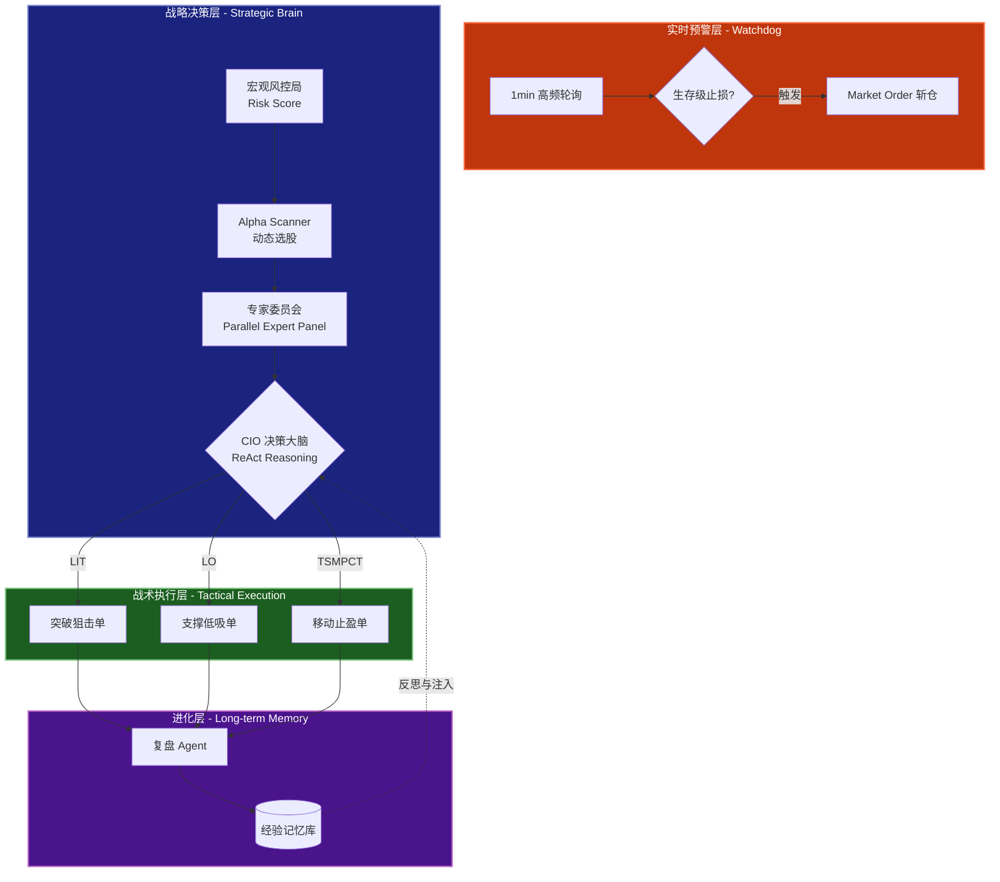
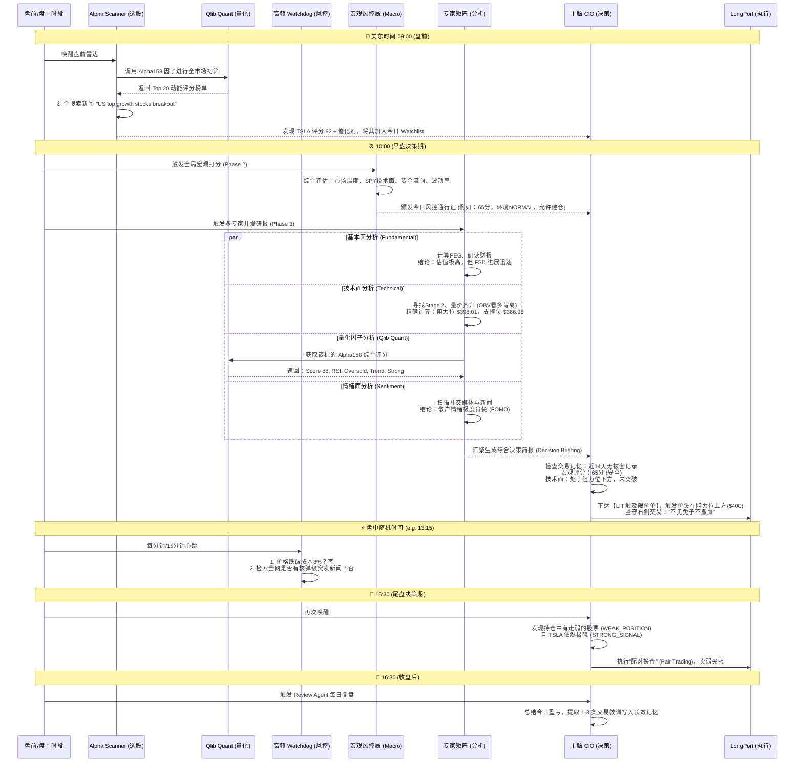

# LP-Agent v3.0: 证券交易自主智能体

[](LICENSE)
[](https://www.python.org/downloads/)
[](#)

LP-Agent 是一款基于 **Strategic Multi-Agent (SMA)** 架构的美股量化交易智能体。系统模拟对冲基金运行模式，由 **CIO (首席投资官)** 统筹技术、基本面、情绪、量化四大专家矩阵，并结合 **Watchdog (生存级监控)** 与 **Long-term Memory (自主进化记忆)**，实现从研报分析到战术下单的全闭环自动化。

---

## 🏛️ 系统逻辑架构 (Core Architecture)



---

## 🚀 LP-Agent v3.0 完整生命周期 (以 TSLA 为例)


系统不再是机械地定时扫盘，而是具备“嗅觉”、“肌肉记忆”和“狙击能力”的智能体。以下是系统在一天中如何捕获并交易 TSLA 的完整流程：



---

## 🏛️ 智能体矩阵 (Agent Matrix)

系统的每次决策并非基于单一 LLM 的“一言堂”，而是由下设的专业委员会进行多维度制衡：

### 0. 宏观风控局 (MacroRiskManager) - 系统的安全总闸
- **职责**：在所有的个股研报开始之前，它负责评估今天的**整体打分水平 (系统性风险)**。它是唯一有权在物理层面“拔网线”的模块。
- **打分逻辑 (总分 100)**：综合评估大盘技术面 (25%)、市场温度 (25%)、资金流向 (15%)、RSI广度 (15%)、市场情绪 (10%) 和波动率 (10%)。
- **约束力**：如果它给出的系统分数跌破 50 分 (LOCKDOWN / CAUTIOUS 模式)，无论后面的专家多么看好某只股票，执行层都会硬性锁死买入权限，强制 CIO 只能防守或斩仓。

### 1. 基本面专家 (FundamentalAnalyst)
- **职责**：挖掘公司核心护城河、估值泡沫及业绩指引，严防“杀估值”。
- **分析内容**：PE (TTM), Forward PE, PEG (核心准则), 毛利率趋势, 机构持仓变动方向。

### 2. 技术面专家 (TechnicalAnalyst)
- **职责**：基于 Mark Minervini 的趋势模板进行形态识别，为 CIO 提供精确的狙击点位。
- **分析内容**：确认股票是否处于 Stage 2 (股价 > SMA50 > SMA200)，判断量价配合 (如 OBV 背离)，并**强制输出**当前的支撑位 (Support) 和突破/阻力位 (Resistance)。

### 3. 情绪面舆情专家 (SentimentAnalyst)
- **职责**：作为反向指标探测器，捕捉市场极端过热 (FOMO) 或过度恐慌的信号。
- **分析内容**：扫描全网新闻、Reddit (WSB) 讨论热度、Twitter 情绪，以及是否有导致大跌的黑天鹅催化剂。

### 4. 量化分析专家 (QuantAnalyst - Powered by Qlib)
- **职责**：提供基于传统机器学习的硬指标评分，作为 LLM 逻辑推理的底层数据支撑。
- **分析内容**：调用微软 Qlib 框架，提取 **Alpha158** 因子集，输出综合预测评分、RSI 状态及趋势强度信号。它在 Alpha Scanner 阶段负责初筛，在个股研报阶段负责精准打分。

---

## 🧠 系统核心能力升级

### 1. 动态雷达：Phase 0 (Alpha Scanner)
系统告别了死板的硬编码标的池。每天盘前 (09:00)，Alpha Scanner 会自动在全网检索最近一周的强势板块、机构评级上调以及具有爆发催化剂的股票，自动将 10-15 只“金股”热更新进当日的内存池。今天的主线是 AI，明天可能就会自动切换到核电或生物医药。

### 2. 战术狙击手：告别无脑市价单 (LIT & LO 订单)
在震荡市中，市价单 (MO) 是被割韭菜的罪魁祸首。
- **技术点位绑定**：技术面专家被强制要求精确计算支撑位 (Support) 和阻力位 (Resistance)。
- **LIT 突破单**：对于看好的未突破股票，CIO 被强制使用 **LIT (触及限价单)**，将买单挂在阻力位上方 0.5% 处，只买确定的突破。
- **LO 低吸单**：对于强趋势的回调，CIO 会在均线支撑位挂 **LO (限价单)** 埋伏。

### 3. 三重防线：极速与深度的完美结合
1. **秒级硬止损 (Watchdog)**：每 1 分钟纯本地扫描一次持仓，一旦跌破成本价 8%，直接无脑市价斩仓，绝不交给大模型思考。
2. **盘中防空警报 (News Watchdog)**：每 15 分钟扫描一次带血腥味的突发宏观新闻（如战争、暴雷）。一旦发现，强行拉响警报唤醒 CIO 紧急避险。
3. **宏观评分硬拦截**：当大盘技术面破位或市场过热导致宏观评分跌破 50 时，交易执行层会在物理层面没收 CIO 的“买入按钮”，仅允许卖出。

### 4. 汰弱留强与肌肉记忆
- **配对交易 (Pair Trading)**：CIO 能够识别组合内的极弱标的 (`WEAK_POSITION`) 和极强候选 (`STRONG_SIGNAL`)，自动卖出弱势股去换仓强势股。
- **长效记忆**：系统在组装研报时会附带过去 14 天该标的的战绩记录。如果系统发现自己在某只股票上反复亏损/频繁止损，会自动触发防御机制，避免变成绞肉机。

---

## 🛠️ 快速开始

### 环境变量要求
建议在 `.env` 中配置至少两个级别的模型，以兼顾决策深度和扫盘速度：

```bash
# ── 主脑 CIO (需具备极高逻辑推理能力) ──
LLM_PROVIDER=gemini
GEMINI_API_KEY="your_pro_key"
GEMINI_MODEL="gemini-3.1-pro-preview"

# ── 专家与巡检犬 (需快响应，低成本) ──
ANALYST_LLM_PROVIDER=gemini
ANALYST_GEMINI_API_KEY="your_flash_key"
ANALYST_GEMINI_MODEL="gemini-3-flash-preview"
```

### 启动命令
使用随附的脚本安全启动并管理进程：
```bash
./start.sh
```
实时查看系统流心与交易日志：
```bash
tail -f agent.log
```

---

## ⚠️ 免责声明
本项目仅供学习和研究目的。自动交易具备极高的资金风险，实盘接入前务必在纸面交易 (Paper Trading) 或模拟账户中长期验证。请务必在有专人监控的情况下运行。
