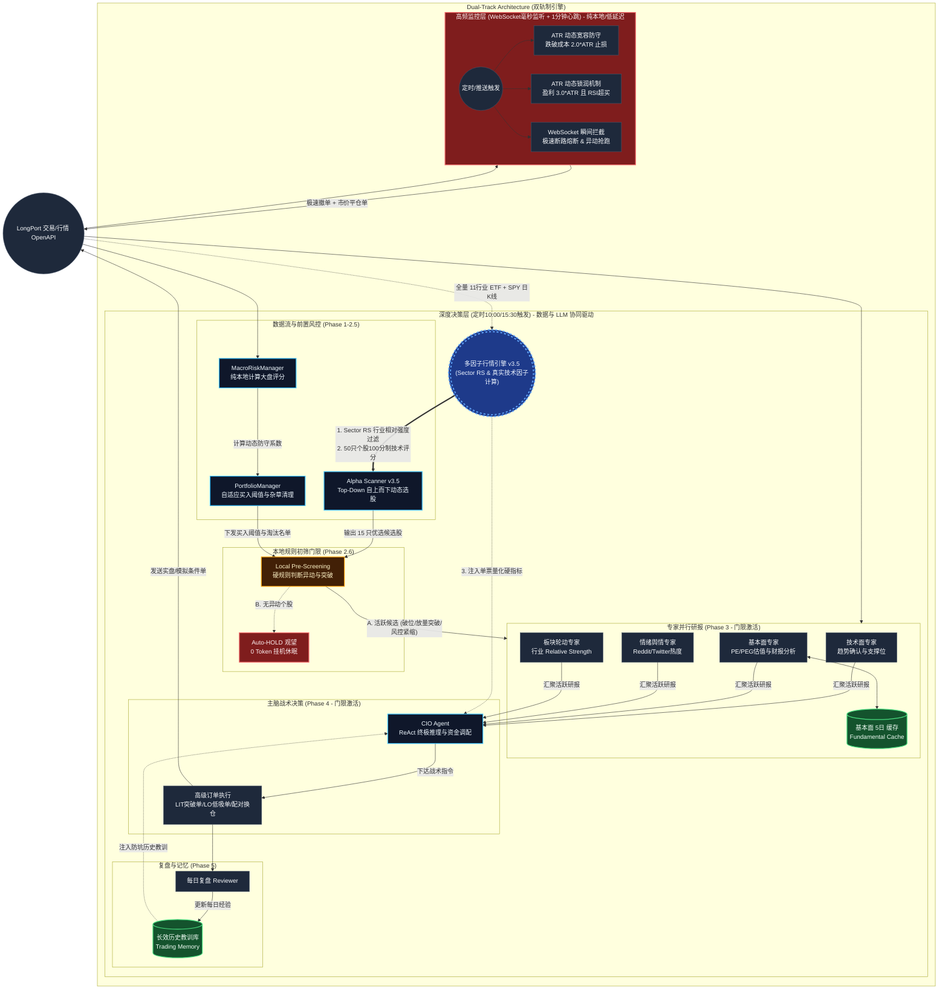
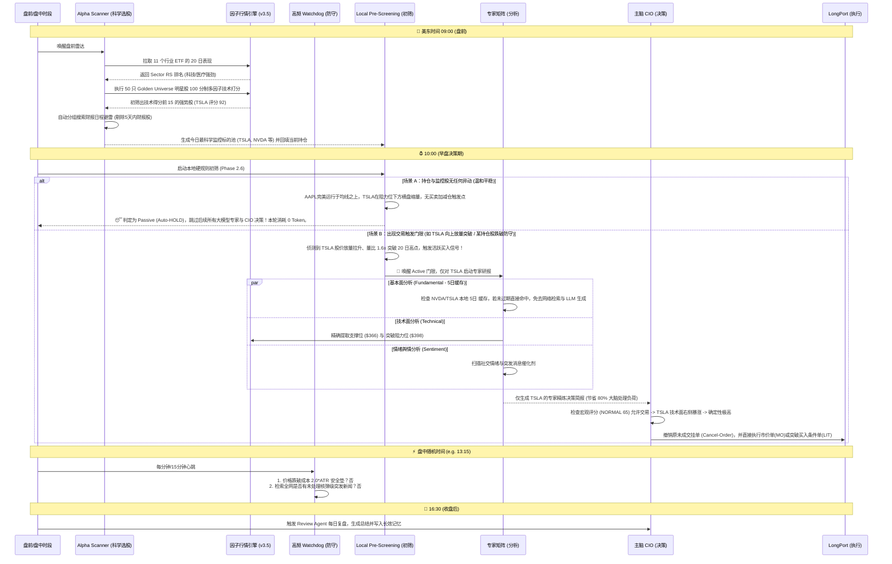

# LP-Agent v3.5: 证券交易自主智能体 (Dual-Track Core)

[](LICENSE)
[](https://www.python.org/downloads/)
[](#)

LP-Agent v3.5 是一款基于 **Strategic Multi-Agent (SMA)** 架构的美股量化交易智能体。系统模拟专业对冲基金运行模式，由 **CIO (首席投资官)** 统筹技术、基本面、舆情、量化、板块轮动五大专家矩阵，并结合 **Watchdog (毫秒生存级监控)** 与 **Long-term Memory (自主进化记忆)**，实现从盘前选股、本地硬规则初筛、门限唤醒到战略决策下单的全闭环自动化。

---

## 🏛️ 系统逻辑架构 (Core Architecture)

*(注：以下为实时渲染的系统逻辑架构，展示了 v3.5 双轨制引擎中本地多因子计算、行业相对强度 RS 过滤、本地规则初筛 Pre-Screening 门限唤醒、以及基本面本地 Cache 机制的相互协同逻辑)*



---

## 🚀 LP-Agent v3.5 完整生命周期时序 (以 TSLA 为例)

系统不再是机械地定时盲目决策，而是融合了“本地极速硬指标打分”、“不惊扰大脑的温和休眠”以及“精准右侧出击”的智能化机器。以下是系统在一天中交易 TSLA 的完整闭环流程：



---

## 🏛️ 智能体矩阵与能力分层 (Agent Matrix & Capability Layers)

系统将任务分为三个能力层次：**纯本地硬量化算法（Level 1）**、**轻量大语言模型专家评级（Level 2）**、**超强推理大语言模型 CIO 终裁（Level 3）**，实现性能与成本的最佳博弈。

### 0. 宏观风控局 (MacroRiskManager) - [L1]
- **职责**：盘中定时计算大盘风控分值（0-100分）。
- **打分逻辑**：综合评估 SPY技术面(25%)、市场温度(25%)、资金流向(15%)、RSI广度(15%)、市场情绪(10%)和波动率(10%)。
- **约束力**：评分 < 50 强制拦截买入，强制 CIO 只能处于防守和斩仓汰弱状态。

### 0.5 投资组合大管家 (PortfolioManager) - [L1]
- **职责**：全局仓位与平仓胜率调度。计算当前持仓的相对强度 (RS)，动态修正买入门槛（防范现金闲置或被频繁洗盘）；识别跑输大盘的“杂草标的”输出为 `weed_out_list` 供 CIO 强制斩仓。

### 1. 板块轮动与多因子量化专家 (QuantAnalyst v3.5) - [L1]
- **职责**：计算 11 个行业 ETF 的 RS 相对强度（Sector RS），并为 Golden Universe 的 50 只大中盘成长龙头计算 100 分制的技术面评分。
- **评分细则**：
  * **Trend (30分)**：价格 > SMA50 且 SMA50 > SMA200（标准 Stage 2 上行趋势）。
  * **RSI (25分)**：RSI 在 50-70 的 BULL 强势区。
  * **Relative Strength (30分)**：个股 20 日涨幅显著超越 SPY（超额 RS 比率 >= 1.05）。
  * **Volume Ratio (15分)**：20日或50日均成交量比。

### 2. 基本面专家 (FundamentalAnalyst) - [L2]
- **职责**：分析公司商业壁垒与估值红线，提供 5 日 Caching 缓存防御，避免高频调用导致的重复网络搜索与 LLM 分析。

### 3. 技术面专家 (TechnicalAnalyst) - [L2]
- **职责**：形态学专家，基于 Mark Minervini 趋势模板输出支撑位 (Support) 和突破阻力位 (Resistance) 价格。

### 4. 情绪舆情专家 (SentimentAnalyst) - [L2]
- **职责**：反向指标扫描，评估 Reddit (WSB)、Twitter 以及大盘主流媒体的情绪泡沫（Greed/Fear/FOMO）。

### 5. 首席投资官 (CIO Agent) - [L3]
- **职责**：基金决策终审脑。基于 **ReAct 终极推理框架**，仅在 Pre-Screening 门限被触发时苏醒。对矛盾专家报告（如基本面高估但技术放量突破）进行逻辑判定，选择 MO/LO/LIT 狙击手订单精准下达。

---

## 🧠 系统核心升级亮点 (V3.5 Highlighting)

### 1. 动态雷达自上而下选股 (Top-Down Alpha Scanning)
告别了死板固定的标的池或全网滞后新闻的检索。Alpha Scanner v3.5 每天盘前自动执行：
1. **行业过滤**：挑选出资金正在净流入的 Strongest Sectors（计算 11 个核心行业相对于 SPY 的 20 日表现）。
2. **个股打分**：在 50 只最具催化动能的流动性黑马中（Golden Universe），用真实 K 线在本地计算 100 分制的多因子技术得分。
3. **财报避险**：自动查询 Top 15 技术候选股未来 5 日内有无财报公布，自动剔除处于绩前财报雷区的个股（非持仓）。
4. **最终标的更新**：将精选出的 10-12 只高概率标的更新为今日 `WATCHLIST`，并**强制合并并回填当前持仓股**。

### 2. 本地硬规则初筛与门限唤醒 (Pre-Screening & Selective Activation)
为阻断每天两次深度大脑调度对 Token 的无谓浪费（90% 的巡检中个股只是处于正常波澜不惊状态）：
- **Local Pre-Screening**：对 15 只关注个股进行规则判断。
  - **持仓股 Active 门限**：跌破 20日线、触发 Watchdog 预警、利润保卫、爆量加仓异动。
  - **监控股 Active 门限**：大涨突破阻力位、成交量比 > 1.3 且 RSI 处于 50-70 上行段。
- **无异动 0 Token 挂机**：未触发任何门限时，不调用任何专家 LLM，不唤醒 CIO ReAct。系统判定 Passive (Auto-HOLD)，挂机休眠，仅通过飞书发送平稳运行简报。

### 3. 基本面 5日 缓存机制 (Fundamental Cache)
公司的竞争壁垒、估值 PEG、机构所有权变化在没有财报开盲盒的情况下是高度静态的。系统提供 `data/fundamental_cache.json` 缓存，在 5 日内对相同股票再次分析时直接读取本地缓存，**实现 0 搜索损耗、0 Token 损耗，分析速度提升 100,000 倍**！

### 4. 战术狙击手：精准高级订单机制 (LIT & LO)
- **LIT 触及限价单**：阻力位上方突破。CIO 填入纯粹支撑/阻力点位，底层交易工具通过 ATR 和当前价格区间自动调用 `_calculate_dynamic_slippage` 精准追加防御抢跑滑点，严防追高。
- **LO 低吸限价单**：均线或筹码密集区低吸回调。
- **撤单重构 (Cancel-Before-Modify)**：强制执行“先撤销再修改”原则，调用 `cancel_order` 剔除单标的同方向挂单竞争，保证订单通道干净。

---

## 🛠️ 快速开始

### 环境变量要求
建议在 `.env` 中配置至少两个级别的模型，以兼顾决策深度和扫盘速度：

```bash
# ── 主脑 CIO (需具备极高逻辑推理能力，推荐 Pro 级) ──
LLM_PROVIDER=gemini
GEMINI_API_KEY="your_pro_key"
GEMINI_MODEL="gemini-3.5-pro-preview"

# ── 专家与选股雷达 (需高响应、低成本，推荐 Flash 级) ──
ANALYST_LLM_PROVIDER=gemini
ANALYST_GEMINI_API_KEY="your_flash_key"
ANALYST_GEMINI_MODEL="gemini-3.5-flash"
```

### 启动命令
使用随附的脚本安全启动并管理进程（支持自动检查 PID 并清理旧进程）：
```bash
./start.sh
```
实时查看系统流水、因子计算与交易日志：
```bash
tail -f agent.log
```

---

## ⚠️ 免责声明
本项目仅供学习和研究目的。自动交易具备极高的资金风险，实盘接入前务必在纸面交易 (Paper Trading) 或模拟账户中长期验证。请务必在有专人监控的情况下运行。
