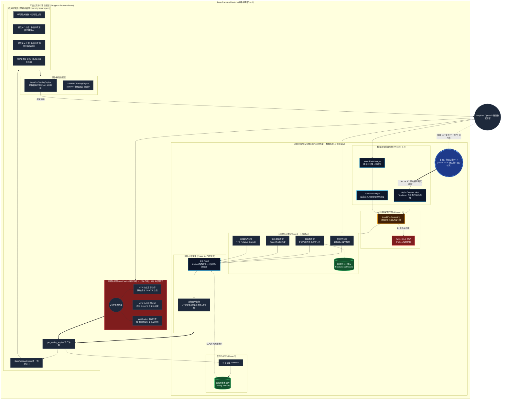
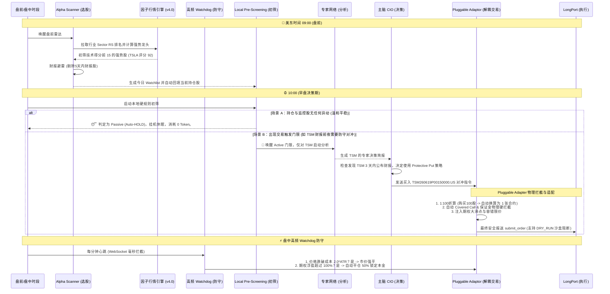

# LP-Agent v4.0: 证券交易自主智能体 (Multi-Broker Decoupled Core)

[](LICENSE)
[](https://www.python.org/downloads/)
[](#)

LP-Agent v4.0 是一款基于 **Strategic Multi-Agent (SMA)** 架构、全面重构为**“行情-交易物理解耦分离”**的高鲁棒性美股量化交易智能体。系统模拟专业对冲基金运行模式，由 **CIO (首席投资官)** 统筹五大专家矩阵，并结合 **Watchdog (毫秒级高频监控)** 与 **Long-term Memory (长效教训记忆)**。

在 V4.0 架构中，长桥（LongPort）被定义为高阶数据行情引擎，而交易执行层通过 `BaseTradingEngine` 彻底重构为**“可拔插券商适配器 (Pluggable Broker Adaptor)”**，完美兼容三大立体期权武器、四大物理防御网以及零资金 DRY_RUN 沙盒系统。

---

## 🏛️ 系统逻辑架构 (Core Architecture)

*(注：展示了 v4.0 行情交易分离架构、可拔插交易引擎、三大立体期权武器、四大物理拦截网与全局沙盒阻断机制)*



---

## 🧠 系统核心升级亮点 (V4.0 Highlighting)

### 1. 行情与交易物理隔离解耦 (Market-Trading Separation)
以前的版本中，各下单工具深度绑定长桥 API 接口。在 V4.0 中，行情层数据（MACD、布林带、期权链到期日、资金流）**继续使用高精度、免费额度丰富的长桥作为数据源中心**。而交易端通过统一的接口 `BaseTradingEngine` 进行了物理上的完全切离。
*   **可插拔式迁移**：要将实盘迁移至 盈立（uSMART） 或 盈透（IBKR），上层 Agent 主脑、多专家、高频哨兵**100% 零修改**。仅需编写 5 个物理接口映射并在 `.env` 中修改 `TRADING_PROVIDER` 即可。

### 2. 立体期权对冲武器库 (Advanced Option Strategies)
CIO（主脑）不仅可以像以前一样做多、空仓，更被赋予了三维空间的期权套利与对冲决策：
*   **保护性看跌 Put (Protective Put)**：重仓股财报前夕、或大盘风险极高时，自动买入 Put 锁定最大亏损，花费 1% 保费护航正股。
*   **备兑看涨 CC (Covered Call)**：正股横盘振荡期，主动 Sell Call，收取稳定权利金，冲抵持仓成本。
*   **现金备兑 Put (Cash-Secured Put)**：下方强技术支撑位上，通过 Sell Put 锁定廉价接盘权利，不跌则白赚保费。

### 3. 四大物理风控安全网与 DRY_RUN 沙盒
由于期权自带杠杆，为了防止 LLM 出现数值幻觉或代码溢出而对账户造成实盘穿透风险，交易底层加装了银行级四大物理防御网（毫秒级纯 Python 硬规则拦截）：
1.  **单笔张数最大硬上限**：单笔下单绝对禁止超过 **5 张**（折合 500 股正股），否则强行拒绝。
2.  **Covered Call 足额持仓硬拦截**：必须持有正股，且正股股数 $\ge$ 期权张数 * 100，否则拒绝下单，斩断裸 Sell CC 带来的无限风险。
3.  **Cash-Secured Put 现金担保硬拦截**：可用现金必须 $\ge$ 行权价 * 数量 * 100，防止保证金爆仓。
4.  **`TRADING_DRY_RUN` 零资金模拟阻断**：在 `.env` 中设置 `TRADING_DRY_RUN=true`，系统正常推理和计算，但在长桥下单前一瞬间阻断 API 调用，100% 无资金耗损观察决策。

---

## 🚀 LP-Agent v4.0 完整生命周期时序



---

## 🛠| 快速开始

### 环境变量要求
建议在 `.env` 中配置至少两个级别的模型，并指定您的交易通道：

```bash
# ── 交易通道物理加载 ──
TRADING_PROVIDER=longport          # 切换为 usmart 即可加载盈立
TRADING_DRY_RUN=true               # 建议设为 true 开启零资金沙盒模拟，安全感拉满

# ── 主脑 CIO (推荐 Pro 级模型) ──
LLM_PROVIDER=gemini
GEMINI_API_KEY="your_pro_key"
GEMINI_MODEL="gemini-3.1-pro-preview"

# ── 专家与选股雷达 (推荐高响应、低成本 Flash 级模型) ──
ANALYST_LLM_PROVIDER=gemini
ANALYST_GEMINI_API_KEY="your_flash_key"
ANALYST_GEMINI_MODEL="gemini-3-flash-preview"
```

### 启动命令
使用随附的脚本安全启动并管理进程：
```bash
./start.sh
```
实时查看因子计算、期权对冲风控与交易日志：
```bash
tail -f agent.log
```

---

## ⚠️ 免责声明
本项目仅供学习和研究目的。期权和股票交易具备极高的资金风险，实盘接入前务必在 DRY-RUN 或纸面交易账户中长期验证。请务必在有专人监控的情况下运行。
