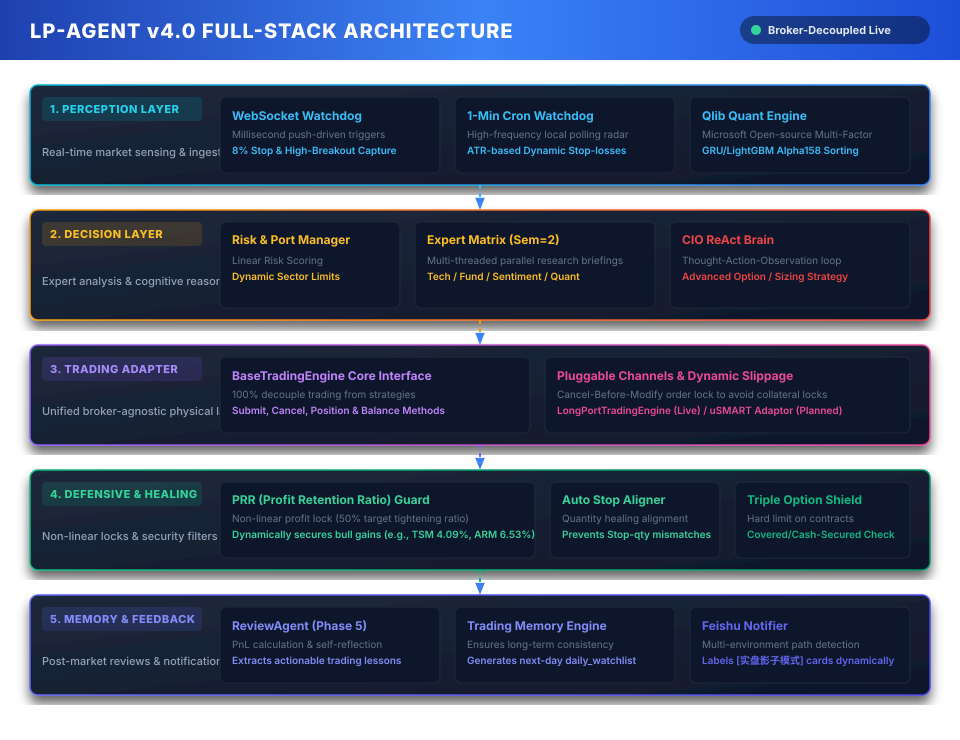
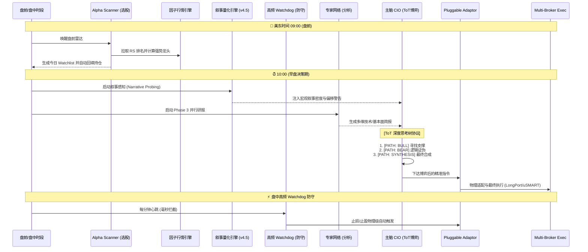

# LP-Agent v4.5.1: 证券交易自主智能体 (Narrative & ToT Powered)

[](LICENSE)
[](https://www.python.org/downloads/)
[](#)

LP-Agent v4.5.1 是一款基于 **Strategic Multi-Agent (SMA)** 架构、由**“叙事量化引擎 (NME)”**与**“深度思考树 (ToT)”**驱动的高进化美股交易智能体。系统模拟专业对冲基金运行模式，由 **CIO (首席投资官)** 统筹六大专家矩阵，并具备感知全网情绪偏移的“直觉”与多路径博弈的“深度”。

在 V4.5 架构中，系统实现了从“技术面被动响应”到“战略性主动博弈”的质变，通过 NME 感知叙事风向，利用 ToT 过滤诱多陷阱，确保在极端市场波动下的决策高质量。

---

## 🏛️ 系统立体分层逻辑架构 (System Full-Stack Architecture)

为了实现系统各层级职责的极致内聚与高解耦，并提供令投资人折服、工业级稳固的系统透视。LP-Agent v4.3 将整个系统的运行机制模块化地划分为以下 **5大标准逻辑层级**。

我们专门设计了下方这套**科技感十足、完美适配浅色与深色模式的像素级 3D 浮雕式分层逻辑架构图**，它精确展现了从毫秒级行情捕获、CIO 主脑推理决策，到物理级 PRR 利润自愈锁和多态飞书监控的完整全景。

<p align="center">
  
</p>

---

## 🧠 系统核心升级亮点 (V4.5 Highlighting)

### 1. 叙事量化引擎 (Narrative Momentum Engine, NME) - NEW!
系统新增了“叙事感知”维度，不再局限于个股新闻，而是量化全网宏观叙事密度：
*   **叙事偏移探测**：实时识别“AI 泡沫论”、“流动性枯竭”、“降息交易”等宏观主题的讨论热度变化率。
*   **直觉先兆**：叙事的转向往往领先于量价指标。NME 为 CIO 提供了一个“风险先兆”层，在技术面走坏前提前捕捉情绪拐点。

### 2. 深度思考树协议 (Tree-of-Thought, ToT) - NEW!
针对 **Tier 1 Leader** 或 **高冲突** 标的，CIO 废除了单向线性推理，升级为多路径博弈：
*   **[PATH: BULL/BEAR/TAIL_RISK]**：强制模型同时构建“乐观支撑”、“质疑证伪”和“压力测试”三条路径。
*   **审判员合成**：通过内部对撞，计算胜率期望值，从根本上过滤掉“开盘诱多”和“虚假突破”。

### 3. 行情与交易物理隔离解耦 (Market-Trading Separation)

### 2. 策略质量审计系统 (Strategy Quality Audit)
V4.3 引入了强制性的策略质量闭环：
*   **Whipsaw 打脸检测**：自动识别并记录卖出后股价反弹、被洗盘出局（Whipsaw）的事件。
*   **回补摩擦成本**：实时计算在 3 天内重新买回同一标的的溢价成本，防止情绪化频繁交易。
*   **数据驱动调优**：所有审计记录存储在 `audit_logs` 中，作为系统动态调整 ATR 乘数和风控因子的唯一量化依据。

*   **可插拔式迁移**：要将实盘迁移至 盈立（uSMART） 或 盈透（IBKR），上层 Agent 主脑、多专家、高频哨兵**100% 零修改**。仅需编写 5 个物理接口映射并在 `.env` 中修改 `TRADING_PROVIDER` 即可。

### 3. 立体期权对冲武器库 (Advanced Option Strategies)
CIO（主脑）不仅可以像以前一样做多、空仓，更被赋予了三维空间的期权套利与对冲决策：
*   **保护性看跌 Put (Protective Put)**：重仓股财报前夕、或大盘风险极高时，自动买入 Put 锁定最大亏损，花费 1% 保费护航正股。
*   **备兑看涨 CC (Covered Call)**：正股横盘振荡期，主动 Sell Call，收取稳定权利金，冲抵持仓成本。
*   **现金备兑 Put (Cash-Secured Put)**：下方强技术支撑位上，通过 Sell Put 锁定廉价接盘权利，不跌则白赚保费。

### 4. 四大物理风控安全网与 DRY_RUN 沙盒
由于期权自带杠杆，为了防止 LLM 出现数值幻觉或代码溢出而对账户造成实盘穿透风险，交易底层加装了银行级四大物理防御网（毫秒级纯 Python 硬规则拦截）：
1.  **单笔张数最大硬上限**：单笔下单绝对禁止超过 **5 张**（折合 500 股正股），否则强行拒绝。
2.  **Covered Call 足额持仓硬拦截**：必须持有正股，且正股股数 $\ge$ 期权张数 * 100，否则拒绝下单，斩断裸 Sell CC 带来的无限风险。
3.  **Cash-Secured Put 现金担保硬拦截**：可用现金必须 $\ge$ 行权价 * 数量 * 100，防止保证金爆仓。
4.  **`TRADING_DRY_RUN` 零资金模拟阻断**：在 `.env` 中设置 `TRADING_DRY_RUN=true`，系统正常推理和计算，但在长桥下单前一瞬间阻断 API 调用，100% 无资金耗损观察决策。

---

## 🚀 LP-Agent v4.5 完整生命周期时序



---

## 🛠| 快速开始

### 环境变量要求
建议在 `.env` 中配置至少两个级别的模型，并指定您的交易通道：

```bash
# ── 交易通道物理加载 ──
TRADING_PROVIDER=longport          # 切换为 usmart 即可加载盈立
TRADING_DRY_RUN=true               # 建议设为 true 开启零资金沙盒模拟，安全感拉满

# ── 主脑 CIO (推荐 Pro 级模型) ──
LLM_PROVIDER=gemini
GEMINI_API_KEY="your_pro_key"
GEMINI_MODEL="gemini-3.1-pro-preview"

# ── 专家与选股雷达 (推荐高响应、低成本 Flash 级模型) ──
ANALYST_LLM_PROVIDER=gemini
ANALYST_GEMINI_API_KEY="your_flash_key"
ANALYST_GEMINI_MODEL="gemini-3-flash-preview"
```

### 启动命令
使用随附的脚本安全启动并管理进程：
```bash
./start.sh
```
实时查看因子计算、期权对冲风控与交易日志：
```bash
tail -f agent.log
```

---

## ⚠️ 免责声明
本项目仅供学习和研究目的。期权和股票交易具备极高的资金风险，实盘接入前务必在 DRY-RUN 或纸面交易账户中长期验证。请务必在有专人监控的情况下运行。
